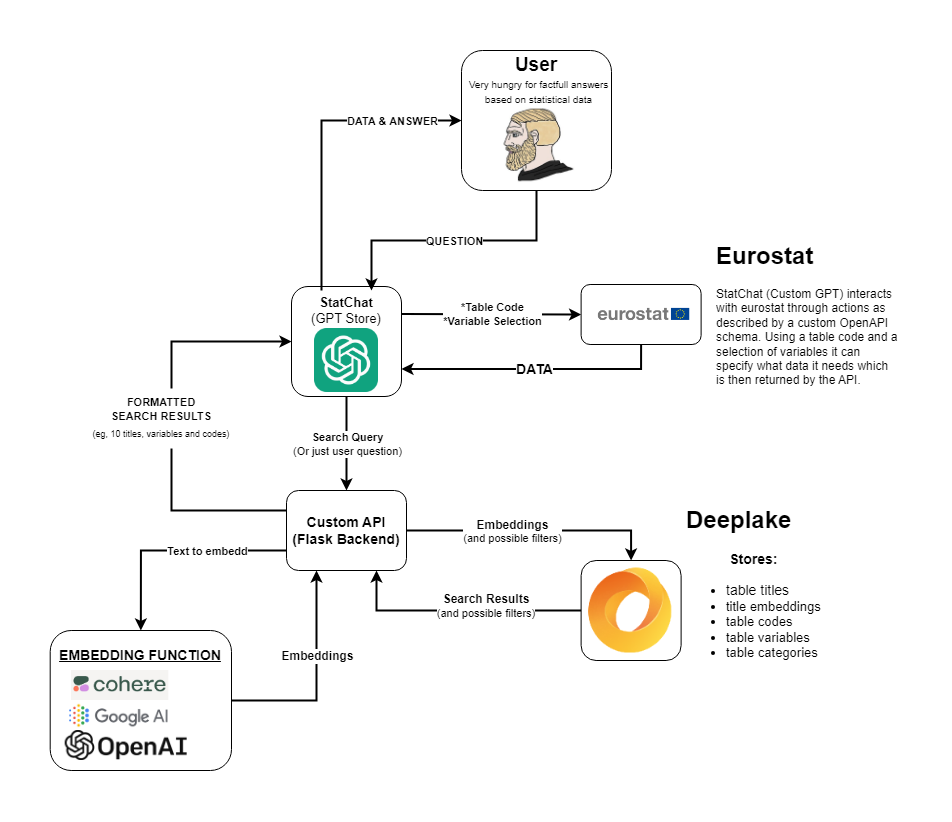

# StatChat: A Statistical Research GPT with DeepLake and Eurostat Integration

StatChat is an innovative GPT-based project designed to showcase new ways we interact with statistical data. By leveraging the power of DeepLake and the Eurostat API, StatChat provides users with an easy-to-use interface to query statistical data and find answers to specific and complex statistical questions that are grounded on reliable and open data. This project also demonstrates the performance improvement of integrating a GPT with a Deeplake vector store and increasing search performance with the use of Deep Memory.

## Features
- **Data Querying**: Directly ask statistical questions and receive accurate, data-driven answers.
- **Deep Memory**: Utilizes DeepLake's Deep Memory feature for enhanced search performance.
- **Eurostat Integration**: Access to a vast array of statistical data from the Eurostat database.
- **Flask API**: A local API to bridge GPT interactions with DeepLake and Eurostat.

## Code Structure

  

